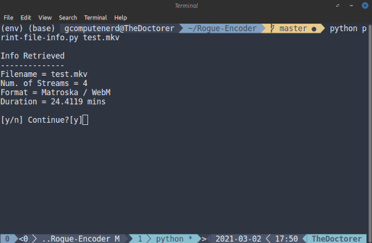
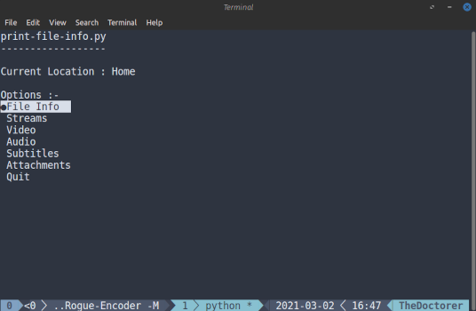

# Rogue Encoder

A Video Conversion tool. Made by @GComputeNerd and @ZeroPrime9 .

This is a utility that acts as an interface to ffmpeg.

This contains a collection of utilities.

## print-file-info.py

`python print-file-info.py filename.mp4`

This presents the information about the streams inside the container file, in a menu format.

